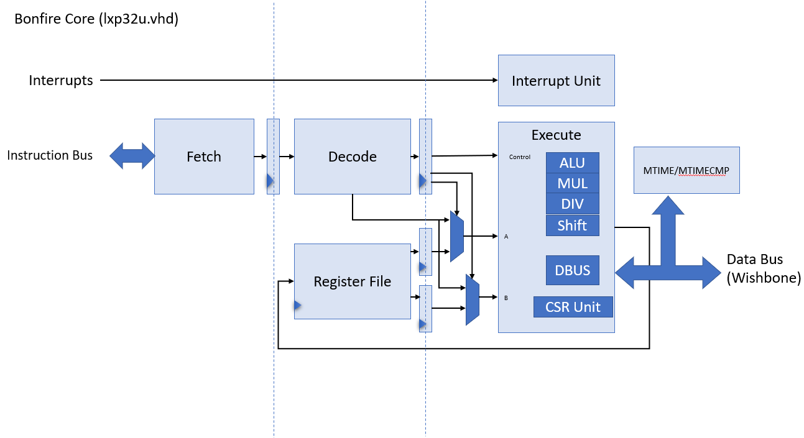

# Bonfire-CPU

Bonfire is a implementation of RISC-V (RV32IM subset) optimized for FPGAs. Since Version 1.4 it can successfully run the riscv-compliance suite.
 [https://github.com/bonfireprocessor/riscv-compliance](https://github.com/bonfireprocessor/riscv-compliance)

It is based on the LXP32 CPU [https://lxp32.github.io/](https://lxp32.github.io/)

The datapath/pipeline is basically still from LXP32. The main difference is in the instruction decoder which was completly rewritten to implement the RV32IM instruction set.
In addition a "real" directed mapped instruction cache can be configured.
Since in Release 1.4 there is a new instruction fetch unit (bonfire_fetch.vhd) which implements a static branch predictor.

 

### New in Release 1.4

##### Static Branch predictor (set generic BRANCH_PREDICTOR to true)

Instantiates a new fetch unit with a static branch predictor. It predicts backwards branches as taken and forward branches as not taken. JAL instructions are also considered as taken.
Latencies:
  * Branches: 6 cycles on misprediction, 2 when predicted correct
  * JAL: 2 cycle
The Fetch unit has an 1-cycle latency on a jump/branch. The 2 cycle latency of JAL is caused by this. For branches the fetch-latency is hidden behind the execution of the comparison in the ALU.

##### RISC-V compliance suite conformity
The core passes RISC-V compliance tests:
* rv32i
* rv32im
* rv32Zicsr
* rv32Zifencei
For instructions how to run the compliance suite refer to the [README](https://github.com/bonfireprocessor/riscv-compliance/blob/master/riscv-target/bonfire/README.md)

### Instruction cycle times

(All numbers without branch predictor)

Instruction Class | Examples    | Latency
------------------|-------------|---------
arithmetic/logical| ADD, ADDI   |   1
Load immediate    | LUI, AUIPC  |   1
Compare and Set   | SLT, SLTI   |   2
Shift             | SLL, SLLI   |   2
Branches          | BEQ, BNE    |   5
Jump & Link       | JAL, JALR   |   4
Load              | LB, LW, LH  |   3
Store             | SW, SH, SB  |   2
CSR Access        | CSRRW, CSRRC|   2
Trap/Return       | ECALL, ERET |   5
Multiplication    | MUL, MULH   |   4
Div/Mod           | DIV, DIVU   |  37

## Privilege mode implementation

The implementation also supports a subset of the RISC-V privilege specification. The processor works only in M-mode. It is not fully compliant yet, because not all mandatory CSR registers are implemented.

### Supported CSR registers

Register Name | Address | Description
--------------|---------|-------------
MSTATUS       | 0x300   | PIE, IE, MPP (fixed to "11")
MISA          | 0x301   | 0x40001100 for RV32IM, Bit 12 cleared when M ext. disabled
MIE           | 0x304   | Interrupt Enable
MTVEC         | 0x305   | Trap Vector
MVENDORID     | 0x311   | Fixed zero (R/O)
MARCHID       | 0x312   | Fixed zero (R/O)
MIMPID        | 0x313   | Core Revision, e.g. 0x10014 for 1.20
MHARTID       | 0x314   | Fixed zero (R/O)
MSCRATCH      | 0x340   | Scratch Register
MEPC          | 0x341   | Exception PC
MCAUSE        | 0x342   | Trap/Interrupt MCAUSE
MIP           | 0x344   | Interrupt Pending
MCYCLE        | 0xb00   | Lower 32 Bit mcycle counter
MCYCLEH       | 0xb80   | Upper 32 Bit mcycle counter
BONFIRE_CSR   | 0x7c0   | Special bonfire CSR (currently ontains only single step bit)

For  a detailed description of the registers see RISC-V privilege spec.

#### Processor version CSR

The MIMPID CSR is filled with the Version of the Bonfire Core. The upper 16 Bits contain the Major Version, the lower 16 Bits the minor Version as unsigned 16 Bit binary numbers
E.g. processor version _1.20_ is encoded as _0x0001 0x0014_

#### Traps

Trap Type          | MCAUSE  | Description
-------------------|---------|------------
Misaligned Fetch   | 0x0     | Jump/trap to a misaligned Address
Illegal instruction| 0x2     | Invalid instruction encountered
Breakpoint         | 0x3     | EBREAK Instruction or single step Trap
Misaligned load    | 0x4     | misaligned LW, LWU, LH or LHU instruction
Misaligned store   | 0x6     | misaligned SW or SH instruction
Environment Call   | 0xb     | ECALL instruction

####  Interrupt Support

The core supports the following interrupts:

Interrupt Source | MIP/MIE Bit | MCAUSE     | Description
-----------------|-------------|------------|-------------
Software int.    | MSIE/P(3)   | 0x80000003 | Software Interrupt
Machine Timer    | MTIE/P(3)   | 0x80000007 | Timer compare interrupts
External Int.    | MEIE/P(11)  | 0x8000000b | External Interrupt
Local Interupt   | MLIE/P (31..16)| 0x80000010-0x80000001f| Local Interrupt  

In the current version of bonfire the Software interrupt cannot be used because the software interrupt I/O register is not implemented

The external interrupt is wired to irq_i(0) of lxp32u_top.
Only local interrupts 0..6 are implemented and wired to irq_i(7:1)

The design is intented to work still also as lxp-32 CPU when the generic parameter RISCV is set to false, but currently I don't test this setting. There is no automated test bench yet, I'm preparing to run the RISC-V test suite on it. But there are several test programs in C and assembler which, together with the surrounding bonfire-soc, allow to test the CPU interactivly in a simulator.

The CPU supports the mtime and mtimecmp timer similar to the RISC-V privilege spec, but both registers are currently limited to 32Bit length.
